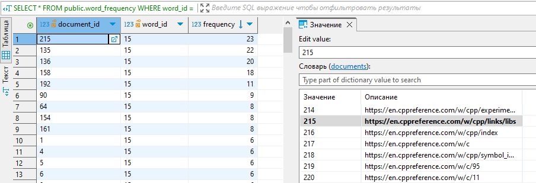

# Дипломный проект: Search Engine  

## Описание проекта  

Данный проект представляет собой поисковую систему, разработанную на языке C++. В разработке использованы следующие библиотеки и технологии:  

- **C++**: основной язык программирования, на котором реализована логика поиска и обработки данных.  
- **Boost**: библиотека, используемая для работы с потоками, сетевыми функциями и асинхронной обработкой.  
- **OpenSSL**: библиотека, обеспечивающая безопасность передачи данных, что особенно важно при работе с личной информацией пользователей.  
- **pqxx**: библиотека для работы с PostgreSQL, которая используется как база данных для хранения информации, собранной клиентом.  

### Архитектура программы  

Программа состоит из двух основных частей:  

1. **Клиентская часть**:  
   - **Обход страниц**: Клиент начинает обход страниц с заданной начальной страницы, которая указывается в файле конфигурации.   
   - **Сохранение данных**: Вся собранная информация (текстовое содержимое страниц) сохраняется в базе данных для последующего поиска.  

2. **Серверная часть**:  
   - **Обработка запросов**: Сервер принимает поисковые запросы от пользователей и обрабатывает их.  
   - **Ранжирование результатов**: Результаты поиска ранжируются и возвращаются пользователю в понятном формате.  

### Конфигурация  

Все входные параметры парсятся из файла конфигурации, включая начальную страницу для обхода.   

- **Данные для подключения к базе данных**
- **Стартовая страница и глубина рекурсии**
- **Порт сервера**  


При использовании следующих параметров:
```ini
[config.ini]
...
startURL=https://en.cppreference.com/w/
recursionDepth=2
```
а также с использованием 24 потоков, клиентская часть выполняется примерно за 70 секунд.   


### Скриншоты  
Скриншот 1. Пример серверной страницы.  
  
Скриншот 2. Поисковая выдача.  
  
Скриншот 3. Данные из базы данных, соответствующие поисковой выдаче  
  

## Инструкция по работе с программой  

1. **Настройка файла конфигурации**:  
   - Убедитесь, что файл конфигурации содержит правильные параметры, включая желаемую стартовую страницу.  
  
2. **Запуск клиентской части**:  
   - Запустите клиентскую часть программы. Дождитесь её завершения. В логах или консоли отобразятся статусы обхода страниц и сохранения данных.  

3. **Запуск серверной части**:  
   - После завершения работы клиентской части запустите серверную часть программы.  
   - Перейдите в браузере на сервер (по умолчанию - [http://localhost:8080](http://localhost:8080)), чтобы открыть интерфейс поиска.  

4. **Использование системы поиска**:  
   - Введите поисковый запрос в соответствующее текстовое поле и нажмите кнопку для отправки запроса.  
   - Посмотрите результаты поиска, которые будут отображены на странице.  

## Заключение  

Данный дипломный проект демонстрирует практическое применение языка C++ и использования современных библиотек для создания эффективной поисковой системы. 
